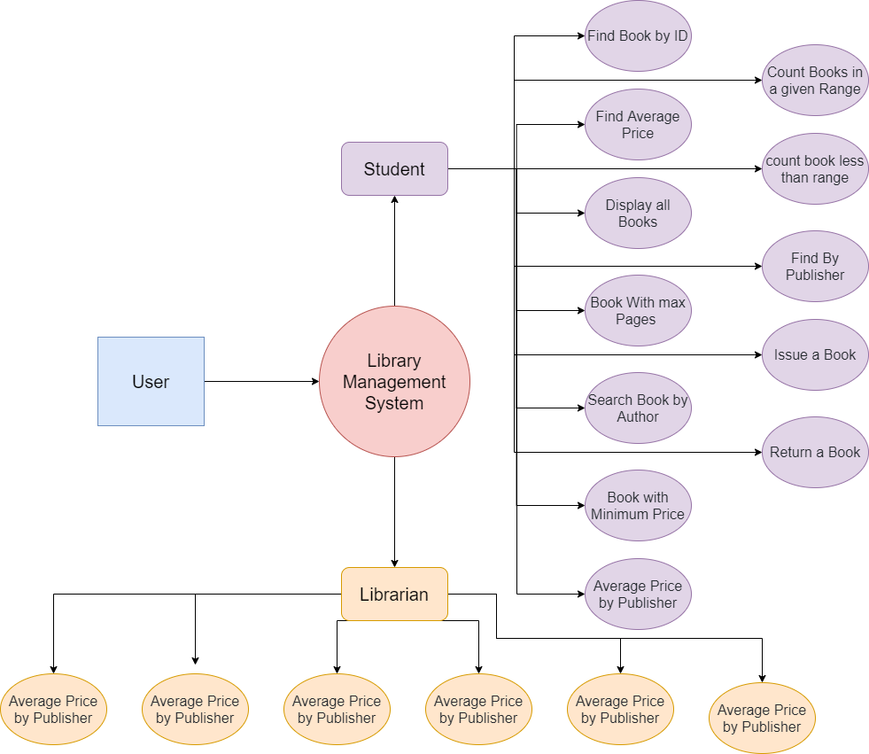
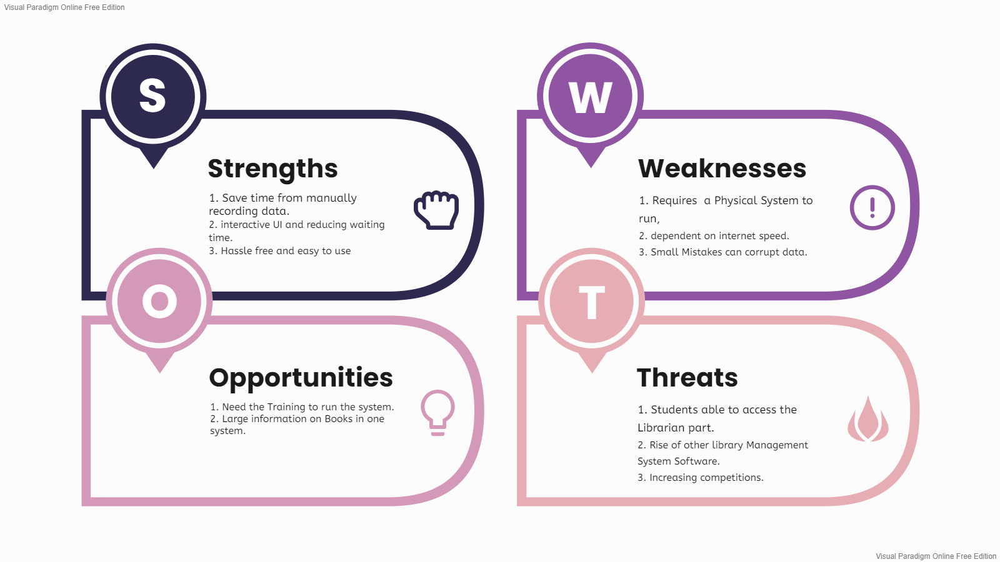

# Requirements
## Introduction
 A Library management system is a software that uses to maintain the record of the library. It contains work like the number of available books in the library, the number of books are issued or returning or renewing a book or late fine charge record, etc. Library Management Systems is software that helps to maintain a database that is useful to enter new books & record books borrowed by the members, with the respective submission dates. Moreover, it also reduces the manual record burden of the librarian.

Library management system allows the librarian to maintain library resources in a more operative manner that will help to save their time. It is also convenient for the librarian to manage the process of books allotting and making payment. Library management system is also useful for students as well as a librarian to keep the constant track of the availability of all books in a store. 

## Research
The Library management system is nowadays essential for schools, colleges, private libraries, and other organizations. They can use this software as the purpose of books issuing and returning for renewal. Moreover, this software helps the librarian to maintain information about book issuing and returning the book before the last date.

Library management system are useful for such organization:

- School libraries
- Collage libraries
- Private libraries
- Reference libraries
- National libraries
- Public libraries
- Modern Public libraries
- Public leading libraries

## Cost and Features
| Time | Features  |	               Cost          |
|:----:|:---------:|:----------------------------:|
| 1960 |The entire management system was carried out on paper|10K|                  	
| 2000 |The mangement was computer based |        30K      |                  	
| 2010 | The management syestem is being carried out with computer application |           100K        |   

The Features of Library Management System are:
1. Find Book by ID - Finding the Book by ID.
2. Find Average Price - Finding the Average Price Books present in library.
3. Display all Books - Display all the Books present in the Library.
4. Book With max Pages - Displaying the book with Max pages. 
5. Search Book by Author - Searching the Book with the Author Name.
6. Book with Minimum Price - Displaying the Book with Minimum Price.
7. Average Price by Publisher - Displaying the average price of its publisher.
8. Count Books in a given Range - Count the number of books present in library in given range.
9. count book less than the given range - Count the number of books present in library less than the given range.
10. Find By Publisher - Finding the Minimum Price of Book of Searched publisher
11. Librarian Specific Task 
    - Accept Issue Book - Accept the issue request by the student.
    - Accept Book return - Accept the Book return by the student.
    - Add book - Add book to library.
    - Remove Book - Remove Book from Library.
    - Get student by Id - Get the Student information bu its ID
    - Get Librarian By username - get libraian information by its username.
12. Issue a Book - Student Issuing the Book, for approval goes to librarian for  approval.
13. Return a Book - Student Returning the Book, for approval goes to librarian for approval.
    
    

## Ageing
### Past
- Information used to be stored in Registers.
- Finding information on Registers or books is tidious work.
- Some Book may cause to misplace and go unnoticed.

### Present
- A Software applicaiton that will take care of storing the data.
- Searching information is easy.
- Book Misplace issue is not there. Database is perfectly maintained.

### Future
- Future will be AI enabled Management System that will take care of all the infomations
- Man power may not be needed to store information.

## Defining Our System

## SWOT ANALYSIS

# 4W&#39;s and 1&#39;H

## Who:

* The System Targets Schools, University, Colleges, and Public Libraries where a lot of Student or Customer come every day.

## What:

* This System holds the data of all the books present in library, which create fast and clear communication between student and librarian. Student can issue book and return book.

## When:

* When sudent want to search for the book and issue it.

## Where:

* The System will be hosted at in-house server within the School or University boundary.

## How:

* This Software will be desktop based application. a Student can search for the book through the internet, but if he/she wants to issue or return book then he/she has to present in the library.

# Detail requirements
## High Level Requirements:
| ID | Feature | Description | Status (Implemented/Future) |
|----|---------|-------------|-----------------------------|
| HR01 | Student | System will help Student to search for book through differnt manner and to issue/return book after that request goes to librarian to approve  |  Implemented|
| HR02 | Management | System will help the Librarian to approve the book that student has requested, Add new book, View Student information  | Implemented |

##  Low level Requirements:
| Sr no. | Feature | Description | Status (Implemented/Future) | HL ID |
|--------|---------|-------------|-----------------------------|-------|
| SF01 | Find Book by ID | Finding the Book by ID |Implemented | HR01 |
| SF02 | Find Average Price | Finding the Average Price Books present in library |Implemented | HR01 |
| SF03 | Display all Books | Display all the Books present in the Library |Implemented | HR01 |
| SF04 | Book With max Pages | Displaying the book with Max pages |Implemented | HR01 |
| SF05 | Search Book by Author | Searching the Book with the Author Name |Implemented | HR01 |
| SF06 | Book with Minimum Price | Displaying the Book with Minimum Price |Implemented | HR01 |
| SF07 | Average Price by Publisher | Displaying the average price of its publisher. |Implemented | HR01 |
| SF08 | Count Books in a given Range | Count the number of books present in library in given range | Implemented| HR01 |
| SF09 | count book less than the given range | Count the number of books present in library less than the given range | Implemented| HR01 |
| SF10 | Find By Publisher | Finding the Minimum Price of Book of Searched publisher | Implemented| HR01 |
| SF11 | Issue a Book | Student Issuing the Book, for approval goes to librarian for  approval | Implemented| HR01 |
| SF12 | Return a Book | Student Returning the Book, for approval goes to librarian for approval | Implemented| HR01 |
| LF01 | Accept Issue Book | Accept the issue request by the student |Implemented | HR02 |
| LF02 | Accept Book return | Accept the Book return by the student | Implemented| HR02 |
| LF03 | Add book | Add book to library |Implemented | HR02 |
| LF04 | Remove Book | Remove Book from Library | Implemented| HR02 |
| LF05 | Get student by Id | Get the Student information bu its ID |Implemented | HR02 |
| LF06 | Get Librarian By username | get libraian information by its username | Implemented| HR02 |
